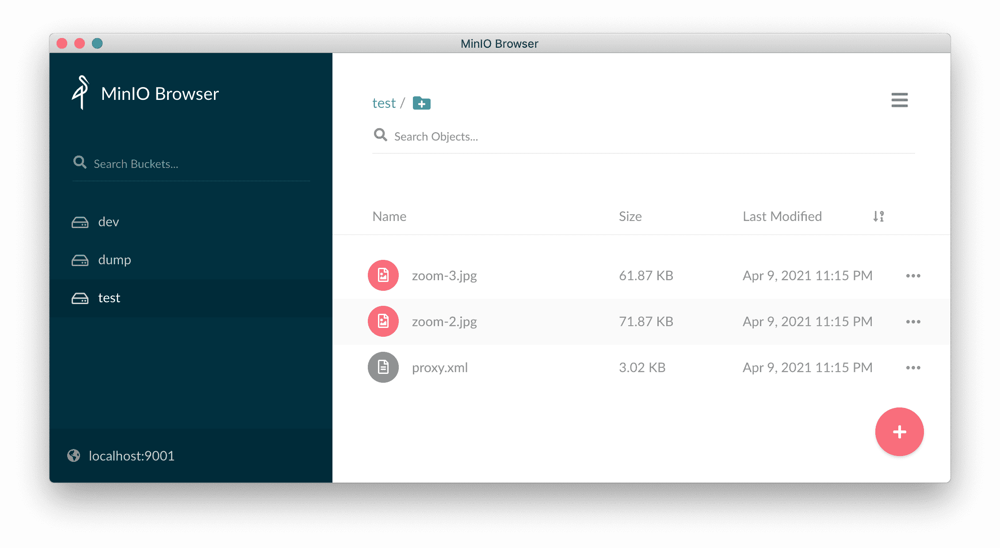

<div align="center">
  
  <h2>A Filesystem Wrapper for AWS S3</h2>
  <p>Manage the remote files on AWS S3 simple as possible</p>

  <p>
    <a href="#">
      
    </a>
    <a href="#">
      
    </a>
  </p>
</div>

---

## 

<div align="center">
  
  <span>I used the `MinIO` docker instead of AWS S3 for local testing</span>
</div>


## Start
```bash
git clone git@github.com:SchwarzIT/php-filesystem.git && cd php-filesystem
make install
make start
```

> `MinIO` on http://localhost:9001/
> - Access-Key: `I3uWTHZGke8RWa1j` 
> - secret-Key: `G0OC3OYQ5Qw59z61`


> `Symfony demo App` on https://127.0.0.1:8000/

#### MinIO login credentials


## Stop
```bash
make stop
```

## Test
```bash
make test
```

## Use the `S3FileSystem` in pure PHP
```php
// instantiate S3 File system
$s3FileSystem = new S3FileSystem($s3Client, self::TEST_S3_BUCKET);

// upload a test file
$s3FileSystem->save($pngFile);

// delete a test file
$s3FileSystem->delete($pdfFile);

// load a test file
$s3FileSystem->get($pdfFile);

// more info see S3FileSystemTest.php
```

## Use the `S3FileSystem` in Symfony Project
```yaml
services:
    Aws\S3\S3Client:
        arguments:
            -   region: '%env(S3_REGION)%'
                endpoint: '%env(S3_ENDPOINT)%'
                version: '2006-03-01'
                use_path_style_endpoint: true
                credentials:
                    key: '%env(S3_ACCESS_KEY)%'
                    secret: '%env(S3_ACCESS_SECRET)%'

    Chapterphp\FileSystem\FileSystemInterface: '@Chapterphp\FileSystem\S3FileSystem'

```

## Open Todos:
- [🔥] implement Symfony 5 Demo with AWS S3 Integraiton
- [🔥] update the README: how to config S3 client + S3FileSystem
- [🔥] complete the unit tests

## licence

MIT [@vikbert](https://vikbert.github.io/)
