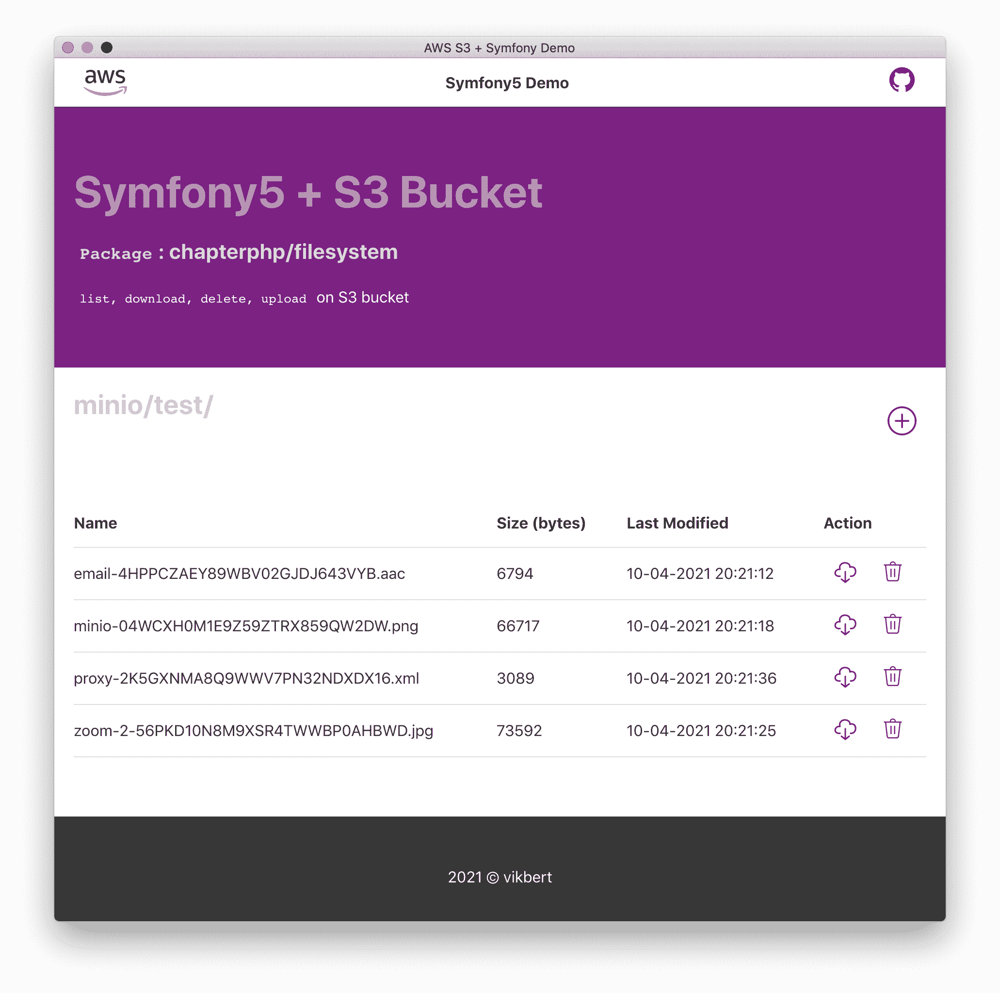

<div align="center">
  
  <h2>A minimal Remote Storage Library</h2>
  <p>Manage the remote files with minimal dependency</p>

  <p>
    <a href="#">
      
    </a>
    <a href="#">
      
    </a>
  </p>
</div>

---

## Supported Remote Storage
There is [Symfony Demo Application](https://github.com/SchwarzIT/storage-symfony-demo) that shows the detailed implementation for `chapterphp/storage`

the following remote storage are supported in this library:
- `AWS S3 Bucket` ✅
- `SAFE` 🛠 
- `MFT sftp` 🛠 

> HINT: 
> - `SAFE` is RESTful archiving solution in STACKIT
> - `MFT` provides the simple document sharing via `sftp` in STACKIT.

<div align="center">
  
</div>

> I used the `MinIO` docker instead of AWS S3 for local testing


<div align="center">
  
</div>

> Symfony + AWS S3 Demo: List, download, delete, upload file object in Symfony5 Demo


# Install
```bash
git clone git@github.com:SchwarzIT/storage.git && cd storage
make install
```

# Run Tests
```bash
make test 
```


> http://localhost:9001/ for `MinIO` bucket (the credentials are test data for local env.)
> - Access-Key: `I3uWTHZGke8RWa1j` 
> - secret-Key: `G0OC3OYQ5Qw59z61`


## Use the `S3Adapter` in pure PHP
```php
// instantiate S3 File system
$S3Adapter = new S3Adapter($s3Client, self::TEST_S3_BUCKET);

// upload a test file
$S3Adapter->save($pngFile);

// delete a test file
$S3Adapter->delete($pdfFile);

// load a test file
$S3Adapter->get($pdfFile);

// more info see S3AdapterTest.php
```

## Use the `S3Adapter` in Symfony Project

config the `AWS S3 Client` and `S3Adapter`
```yaml
## config/packages/s3.yaml
services:
    Aws\S3\S3Client:
        arguments:
            -   region: '%env(S3_REGION)%'
                endpoint: '%env(S3_ENDPOINT)%'
                version: '2006-03-01'
                use_path_style_endpoint: true
                credentials:
                    key: '%env(S3_ACCESS_KEY)%'
                    secret: '%env(S3_ACCESS_SECRET)%'

    Chapterphp\Storage\RemoteStorageInterface: '@Chapterphp\Storage\S3Adapter'
```

config the services for the package ``
```yaml
### config/services.yaml
services:
    Chapterphp\Storage\S3Adapter:
        arguments:
            $s3Bucket: '%env(S3_BUCKET)%'
```

## licence

[apache-2.0](https://choosealicense.com/licenses/apache-2.0/) [@vikbert](https://vikbert.github.io/)
